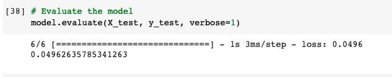

# LSTM Stock Predictor
Recurrent Neural Networks using Tensorflow

## LSTM Stock Predictor Using Fear and Greed Index vs. Closing Prices

## Which model has a lower loss?

With same window size of 10, the LSTM Stock Predictor Using Closing Prices had a lower loss (.0174) than 
LSTM Stock Predictor Using Fear and Greed Index (.0920)

Closing Prices

Fear and Greed Index

## Which model tracks the actual values better over time?

LSTM Stock Predictor Using Closing Prices tracks more closely to actual close prices over time. 

Closing Prices

Fear and Greed Index

## Which window size works best for the model?

Window size 10 works best for LSTM Stock Predictor Using Closing Prices model out of trials with values 1, 5, & 10. 

Window Size 1

Window Size 5

Window Size 10 (same as above)

## Takeaway

It appears our RNN model was better able to predict when trained using daily close prices as the only feature. When fed fear and greed index values as the lone feature, it had higher loss and less accurate predictions. 